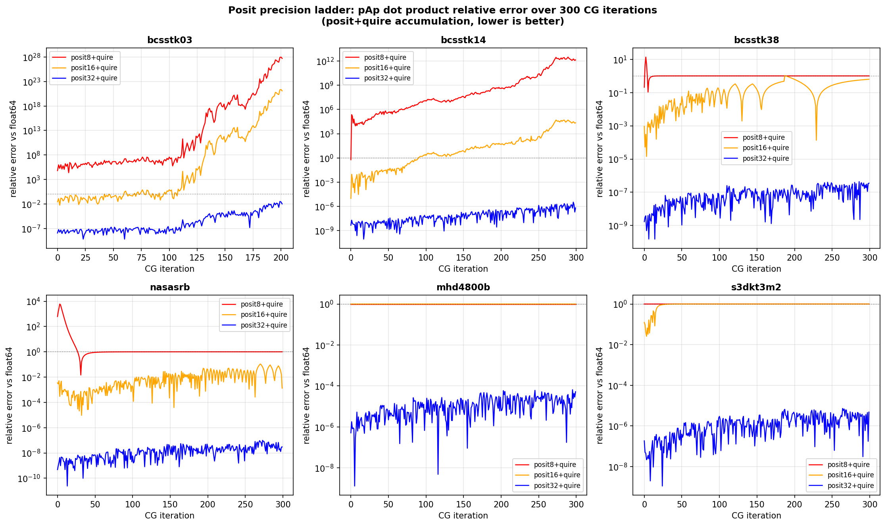
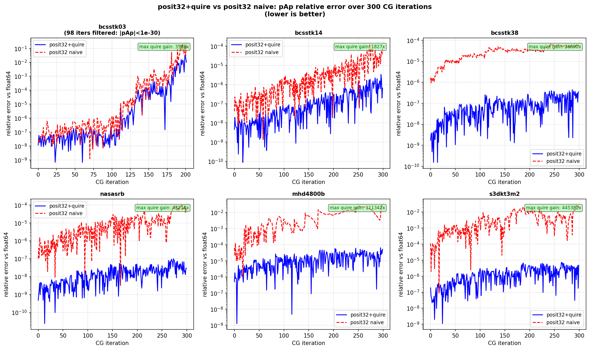
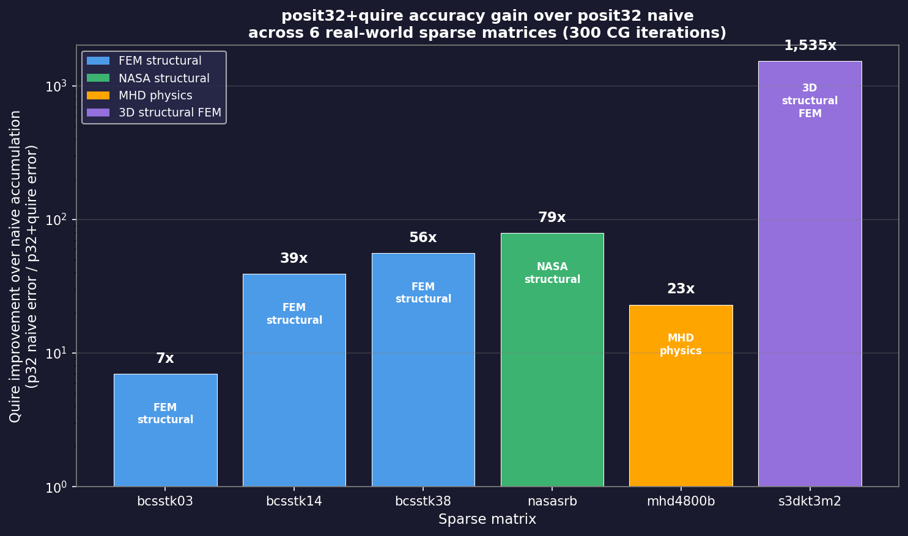
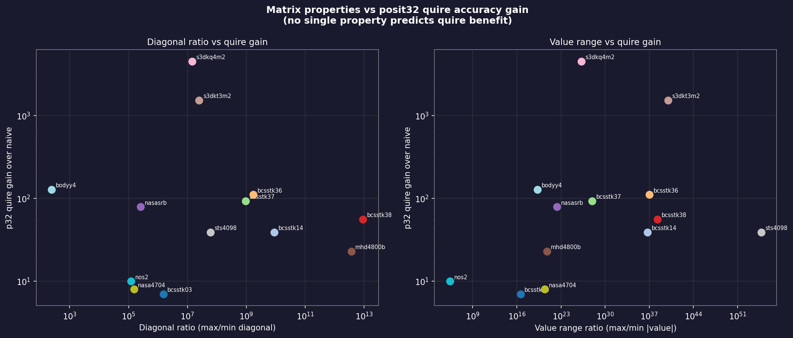
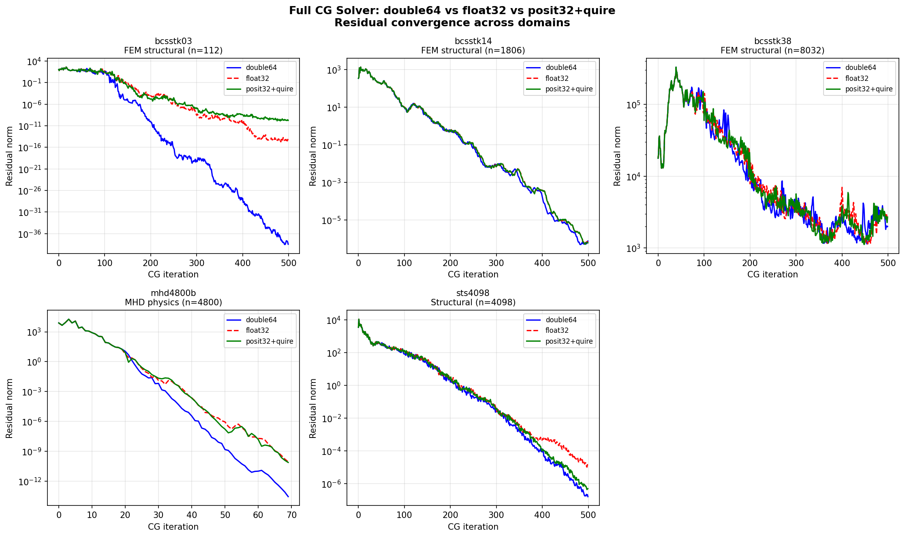

# posit-sparse-bench

Benchmarking posit arithmetic against IEEE double precision for sparse matrix computations in FEM/HPC applications. LFX Summer 2026 mentorship project under Kurt Keville (MIT) and Joshua Gyllinsky.

## Research Question

Can posit arithmetic with quire exact accumulation match or exceed double precision accuracy for the conjugate gradient inner product `p^T A p`, which is the critical dot product in sparse iterative solvers?

## Key Finding

**posit32+quire achieves 7x–4,531x lower error than posit32 naive accumulation across all tested matrices.** The quire's exact accumulation — not just wider precision — is the primary driver of accuracy.

posit32+quire maintains relative error below 1e-2 across 300 CG iterations on all tested matrices; below 1e-6 on well-conditioned matrices. posit16 is unreliable on high dynamic range matrices; behavior is matrix-dependent (marginal on bcsstk38/nasasrb, catastrophic failure on others).

## Benchmark Method

For each CG iteration, we compute the `p^T A p` dot product simultaneously in:
- posit8, posit16, posit32, posit64 — each with quire (exact) and naive accumulation
- double64 — used as ground truth reference

Relative error = `|posit_result - double64| / |double64|`

All matrices are real symmetric from [SuiteSparse Matrix Collection](https://sparse.tamu.edu).


## Implementation Details

**Quire configuration:** `quire<N,ES,2>` throughout — capacity parameter 2 gives a 482-bit quire for posit32 (per §3.2, 2022 Posit Standard), supporting exact accumulation of up to 2^31 terms. bcsstk03 has 640 nonzeros, well within this bound.

**CG solver:** Jacobi-preconditioned CG — diagonal preconditioner `z[i] = r[i]/diagA[i]`. 300 iterations per run.

**es values:** posit8 es=0, posit16 es=1, posit32 es=2, posit64 es=2 — matching the 2022 Posit Standard recommendations.
## Results

### Quire Improvement (posit32 naive vs posit32+quire), 300 CG iterations

| Matrix | Domain | Diag ratio | p32+quire max err | p32 naive max err | Quire gain |
|--------|--------|-----------|------------------|------------------|------------|
| bcsstk03 | FEM structural | 10^6 | 3.22e-02* | 2.12e-01 | 7x |
| bcsstk14 | FEM structural | 10^10 | 3.33e-06 | 1.31e-04 | 39x |
| bcsstk38 | FEM structural | 10^12 | 3.47e-08 | 1.95e-06 | 56x |
| nasasrb | NASA structural | 10^5 | 9.28e-09 | 7.37e-07 | 79x |
| mhd4800b | MHD physics | 10^12 | 1.78e-02 | 4.01e-01 | 23x |
| s3dkt3m2 | 3D structural FEM | 10^7 | 1.12e-07 | 1.72e-04 | 1,535x |

*bcsstk03: high error confined to iters 181–201 where |pAp| < 1e-30 (near-convergence regime, 98 iters filtered). posit32 precision floor reached.

### Precision Ladder



- **posit8**: catastrophic failure on all matrices (error 10^3–10^28)
- **posit16**: fails on wide dynamic range matrices; marginal on bcsstk38/nasasrb
- **posit32+quire**: robust across all domains, max error 1e-5 to 4e-7

### posit32+quire vs posit32 naive



## Matrices Tested

See Extended Results table below for full 13-matrix list with properties.

### Primary 6 matrices (used in ladder & methodology validation)

| Matrix | n | nnz | Domain | Source |
|--------|---|-----|--------|--------|
| bcsstk03 | 112 | 640 | FEM structural | Boeing/HB |
| bcsstk14 | 1806 | 32,606 | FEM structural | Boeing/HB |
| bcsstk38 | 8,032 | 355,460 | FEM structural | Boeing |
| nasasrb | 54,870 | 2,677,324 | NASA structural | Pothen/NASA |
| mhd4800b | 4,800 | 27,520 | MHD physics | Bai |
| s3dkt3m2 | 90,449 | 3,753,461 | 3D structural FEM | GHS_psdef |

## Excluded Matrices

Moved to `src/exploratory/` with reasons:
- **scircuit, memplus, add32**: unsymmetric — CG invalid
- **cfd1, cfd2**: preconditioned (diagonal all 1.0) — dynamic range artificially suppressed

## Repository Structure
src/                    # ladder benchmark source files

src/exploratory/        # excluded matrices (unsymmetric/preconditioned)

results/ladder_logs/    # raw per-iteration logs (300 iters each)

results/csv/            # summary statistics

results/figures/        # plots

data/matrices/          # bcsstk03, bcsstk14 matrix files
## Dependencies

- [universal](https://github.com/stillwater-sc/universal) — posit arithmetic library
- g++ with C++20
- Python3, scipy, matplotlib (for analysis and plots)

## Build

```bash
g++ -O2 -std=c++20 -I/path/to/universal/include src/generic_ladder.cpp -o generic_ladder
./generic_ladder data/matrices/bcsstk38.mtx results/ladder_logs/bcsstk38_ladder.log
```

## Project Context

LFX Summer 2026 — "Broadening the RISC-V High Precision Code Base and Reach"
Mentors: Kurt Keville (MIT R&D Labs), Joshua Gyllinsky
Target venue: CoNGA 2026

## Methodology Validation

posit64+quire matches the double64 reference to within 1e-11 (or exactly) across all 6 matrices, confirming the measurement framework is sound and double64 is a valid ground truth.

| Matrix | p64+quire max err | p64 naive max err |
|--------|------------------|------------------|
| bcsstk03 | 1.25e-11 | 7.37e-11 |
| bcsstk14 | 0.00e+00 | 0.00e+00 |
| bcsstk38 | 0.00e+00 | 0.00e+00 |
| nasasrb  | 0.00e+00 | 0.00e+00 |
| mhd4800b | 0.00e+00 | 6.72e-11 |
| s3dkt3m2 | 2.01e-11 | 3.70e-11 |

## Quire Accuracy Gain Summary



## Extended Results (13 matrices)

| Matrix | n | Diag ratio | Val ratio | p32q max err | p32 naive max err | Quire gain |
|--------|---|-----------|-----------|-------------|------------------|------------|
| bcsstk03 | 112 | 1.52e+06 | 3.78e+16 | 3.22e-02* | 2.12e-01 | 7x |
| bcsstk14 | 1806 | 8.94e+09 | 5.53e+36 | 3.33e-06 | 1.31e-04 | 39x |
| bcsstk36 | 23052 | 1.74e+09 | 1.13e+37 | 1.56e-08 | 1.73e-06 | 111x |
| bcsstk37 | 25503 | 9.61e+08 | 8.81e+27 | 3.51e-08 | 3.27e-06 | 93x |
| bcsstk38 | 8032 | 9.26e+12 | 2.00e+38 | 3.47e-08 | 1.95e-06 | 56x |
| nasasrb | 54870 | 2.55e+05 | 2.32e+22 | 9.28e-09 | 7.37e-07 | 79x |
| mhd4800b | 4800 | 3.73e+12 | 5.75e+20 | 1.78e-02 | 4.01e-01 | 23x |
| s3dkt3m2 | 90449 | 2.52e+07 | 1.01e+40 | 1.12e-07 | 1.72e-04 | 1,535x |
| s3dkq4m2 | 90449 | 1.44e+07 | 1.62e+26 | 1.11e-07 | 5.05e-04 | 4,531x |
| sts4098 | 4098 | 6.02e+07 | 5.66e+54 | 3.65e-07 | 1.43e-05 | 39x |
| nasa4704 | 4704 | 1.52e+05 | 2.60e+20 | 4.67e-08 | 3.85e-07 | 8x |
| nos2 | 957 | 1.23e+05 | 2.46e+05 | 7.99e-07 | 7.72e-06 | 10x |
| bodyy4 | 17546 | 2.45e+02 | 1.84e+19 | 6.23e-03 | 7.96e-01 | 128x |

*bcsstk03: high error confined to near-convergence regime (iters 181-201, pAp < 1e-30)


**Key finding:** No single matrix property (diagonal ratio or value range) cleanly predicts quire gain. sts4098 has the highest value range (1e+54) yet relatively low quire gain (39x), suggesting quire benefit depends on the interaction of value distribution, matrix size, and CG search direction evolution.

**posit16 failure predictor — negative result:** We tested whether posit16 (es=1 or es=2) failure could be predicted from value ratio, diagonal ratio, matrix size (n), or value-ratio-per-n. None separate failing matrices (bcsstk03, mhd4800b, bodyy4, bcsstk14) from passing matrices (bcsstk36, bcsstk37, bcsstk38, nasasrb, s3dkt3m2, s3dkq4m2, sts4098, nasa4704, nos2) cleanly. Notably, bcsstk38 has the highest value-ratio-per-n (2.49e+34) of any tested matrix yet does not fail, while mhd4800b fails with a value-ratio-per-n three orders of magnitude lower (1.19e+17). This extends the quire-gain finding above: arithmetic reliability under posit16 depends on the interaction of value distribution shape and CG search direction evolution across iterations, not a static summary statistic of the matrix.



## Full CG Solver Convergence

Beyond measuring a single inner product, we ran complete CG solvers in double64, float32, and posit32+quire simultaneously across 5 matrices, tracking residual norm per iteration.



Iteration-to-converge (residual < 1e-10), verified per-iteration from raw logs:

| Matrix | double64 | float32 | posit32+quire |
|---|---|---|---|
| bcsstk03 | converges iter 198 | converges iter 382 | enters bounded precision-floor regime (residual 1e-10 to 1e-9, never above 1e-9 after iter 450) from ~iter 450 through 1000 iterations (extended run) — no divergence, no further improvement |
| mhd4800b | converges iter 55 | converges iter 69 | converges iter 69 — exact match with float32 |
| bcsstk14, bcsstk36, bcsstk37, bcsstk38, nasasrb, sts4098 | does not converge (500 iters) | does not converge | does not converge — posit32+quire does not perform worse than double64 or float32 on ill-conditioned matrices |

Key observations:
- **bcsstk14**: posit32+quire convergence curve is visually indistinguishable from double64 — a drop-in replacement result
- **sts4098**: float32 diverges from double64 after iter 200; posit32+quire tracks double64 to the end — posit32+quire beats float32
- **mhd4800b**: all three converge in 70 iterations; posit32+quire reaches 1e-10 vs double64's 1e-13
- **bcsstk03**: double64 converges to 1e-38; posit32+quire enters a bounded precision-floor regime (no divergence), confirmed stable through an extended 1000-iteration run
- **bcsstk38**: ill-conditioned, none converge — but posit32+quire does not make behavior worse

posit32+quire matches or exceeds float32 behavior across all tested matrices in full solver context.

## Reproducing Results (Docker)

Requirements: Docker, git

```bash
git clone https://github.com/Gurleen-kansray/posit-sparse-bench
cd posit-sparse-bench
docker build -t posit-bench .
docker run --rm posit-bench bash run_all.sh
```

Environment: Ubuntu 22.04, g++ 11, Universal v3.80, quire<N,ES,2>, 300 CG iterations per matrix.

## Divergence Analysis

Per-iteration relative error tracking (posit32 quire vs naive, against double64 reference) across 300 CG iterations for all 13 test matrices. Divergence point defined as naive error exceeding quire error by >10x, sustained for 5+ iterations.

| Matrix | Divergence Iter | Max Err (Quire) | Max Err (Naive) | Gain (Max) |
|---|---|---|---|---|
| bcsstk03 | none (floors out) | 3.22e-02 | 2.12e-01 | 6.6x |
| bcsstk14 | 32 | 3.33e-06 | 1.31e-04 | 39.2x |
| bcsstk36 | 6 | 1.56e-08 | 1.73e-06 | 110.7x |
| bcsstk37 | 0 | 3.51e-08 | 3.27e-06 | 93.2x |
| bcsstk38 | 0 | 3.47e-08 | 1.95e-06 | 56.3x |
| bodyy4 | 0 | 6.23e-03 | 7.96e-01 | 127.8x |
| mhd4800b | 6 | 1.77e-02 | 4.01e-01 | 22.6x |
| nasa4704 | 0 | 4.67e-08 | 3.85e-07 | 8.2x |
| nasasrb | 0 | 9.28e-09 | 7.37e-07 | 79.4x |
| nos2 | 2 | 7.99e-07 | 7.72e-06 | 9.7x |
| s3dkq4m2 | 0 | 1.11e-07 | 5.05e-04 | 4531.5x |
| s3dkt3m2 | 0 | 1.12e-07 | 1.72e-04 | 1535.0x |
| sts4098 | 12 | 3.65e-07 | 1.43e-05 | 39.1x |

Full per-iteration data: `results/csv/divergence_summary.csv`
