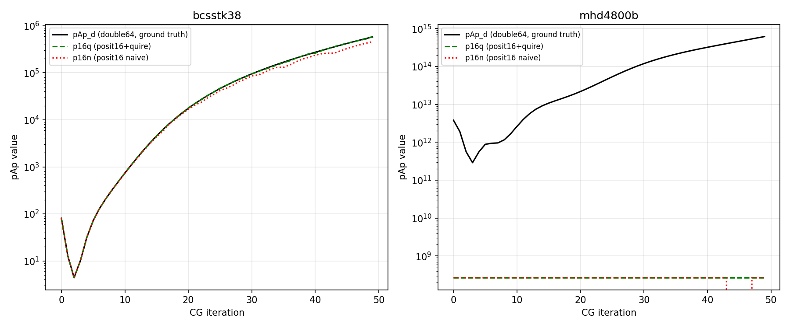

# posit-sparse-bench

Benchmarking posit arithmetic against IEEE double precision for sparse matrix computations in FEM/HPC applications. LFX Summer 2026 mentorship project under Kurt Keville (MIT) and Joshua Gyllinsky.

## Research Question

Can posit arithmetic with quire exact accumulation match or exceed double precision accuracy for the conjugate gradient inner product `p^T A p`, which is the critical dot product in sparse iterative solvers?

## Key Finding

**posit32+quire achieves 6.6x–4,531x lower error than posit32 naive accumulation across all tested matrices.** The quire's exact accumulation — not just wider precision — is the primary driver of accuracy.

posit32+quire maintains relative error below 4e-2 across 300 CG iterations on all tested matrices (below 1e-2 on 11 of 13; two matrices near precision floor reach ~2-3e-2); below 1e-6 on well-conditioned matrices. posit16 is unreliable on high dynamic range matrices; behavior is matrix-dependent (marginal on bcsstk38/nasasrb, catastrophic failure on others).

## Benchmark Method

For each CG iteration, we compute the `p^T A p` dot product simultaneously

- double64 — used as ground truth reference

Relative error = `|posit_result - double64| / |double64|`

All matrices are real symmetric from [SuiteSparse Matrix Collection](https://sparse.tamu.edu).


## Implementation Details

**Quire configuration:** `quire<N,ES,2>` throughout — capacity parameter 2 gives a 482-bit quire for posit32, derived directly from the Universal library source (qbits = escale*(4*nbits-8) + capacity, where escale = 2^es). Capacity=2 formally guarantees exact accumulation of up to 4 worst-case-magnitude (maxpos^2) terms; in practice, real matrix entries are far below maxpos^2 in magnitude, so overflow does not occur even with hundreds of thousands of accumulations (e.g., bcsstk38's 355,460 nonzeros).

**CG solver:** Jacobi-preconditioned CG — diagonal preconditioner `z[i] = r[i]/diagA[i]`. 300 iterations per run.

**es values:** Per the 2022 Posit Standard (es=2 for all sizes), confirmed directly with John Gustafson — thank you to Prof. Gustafson for clarifying this. Our ladder results below include both configurations: the legacy variable-es convention (posit8 es=0, posit16 es=1, posit32/64 es=2) used in earlier posit literature, and the standard-compliant es=2 uniform configuration, to show how the fixed exponent size affects posit8/16 behavior relative to the older convention.
## Results

### Quire Improvement (posit32 naive vs posit32+quire), 300 CG iterations

| Matrix | Domain | Diag ratio | p32+quire max err | p32 naive max err | Quire gain |
|--------|--------|-----------|------------------|------------------|------------|
| bcsstk03 | FEM structural | 10^6 | 3.22e-02* | 2.12e-01 | 6.6x |
| bcsstk14 | FEM structural | 10^10 | 3.33e-06 | 1.31e-04 | 39x |
| bcsstk38 | FEM structural | 10^12 | 3.47e-08 | 1.95e-06 | 56x |
| nasasrb | NASA structural | 10^5 | 9.28e-09 | 7.37e-07 | 79x |
| mhd4800b | MHD physics | 10^12 | 1.78e-02 | 4.01e-01 | 23x |
| s3dkt3m2 | 3D structural FEM | 10^7 | 1.12e-07 | 1.72e-04 | 1,535x |

*bcsstk03: high error confined to iters 181–201 where |pAp| < 1e-30 (near-convergence regime, 98 iters filtered). posit32 precision floor reached.

### Precision Ladder


- **posit8**: catastrophic failure on all matrices (error 10^3–10^28)
- **posit16**: fails on wide dynamic range matrices; marginal on bcsstk38/nasasrb
- **posit32+quire**: robust across all domains, max error 9.28e-09 to 3.22e-02 (two matrices near the posit32 precision floor account for the upper end; well-conditioned matrices stay below 1e-6)

### posit32+quire vs posit32 naive


## Matrices Tested

See Extended Results table below for full 13-matrix list with properties.

### Primary 6 matrices (used in ladder & methodology validation)

| Matrix | n | nnz | Domain | Source |
|--------|---|-----|--------|--------|
| bcsstk03 | 112 | 640 | FEM structural | Boeing/HB |
| bcsstk14 | 1806 | 32,606 | FEM structural | Boeing/HB |
| bcsstk38 | 8,032 | 355,460 | FEM structural | Boeing |
| nasasrb | 54,870 | 2,677,324 | NASA structural | Pothen/NASA |
| mhd4800b | 4,800 | 27,520 | MHD physics | Bai |
| s3dkt3m2 | 90,449 | 3,753,461 | 3D structural FEM | GHS_psdef |

## Excluded Matrices

Moved to `src/exploratory/` with reasons:
- **scircuit, memplus, add32**: unsymmetric — CG invalid
- **cfd1, cfd2**: preconditioned (diagonal all 1.0) — dynamic range artificially suppressed

## Repository Structure
src/                    # ladder benchmark source files

src/exploratory/        # excluded matrices (unsymmetric/preconditioned)

results/                # raw per-iteration logs (300 iters each, gitignored — regenerate via run_all.sh)

results/csv/            # summary statistics

results/figures/        # plots

data/matrices/          # 13 tested matrices (see Excluded Matrices for others present but not used)
## Dependencies

- [universal](https://github.com/stillwater-sc/universal) — posit arithmetic library
- g++ with C++20
- Python3, scipy, matplotlib (for analysis and plots)

## Build

```bash
g++ -O2 -std=c++20 -I/path/to/universal/include src/generic_ladder.cpp -o generic_ladder
./generic_ladder data/matrices/bcsstk38.mtx results/bcsstk38_ladder.log
```

## Project Context

LFX Summer 2026 — "Broadening the RISC-V High Precision Code Base and Reach"
Mentors: Kurt Keville (MIT R&D Labs), Joshua Gyllinsky
Target venue: CoNGA 2026

## Methodology Validation

posit64+quire matches the double64 reference to within 1e-11 (or exactly) across all 6 matrices, confirming the measurement framework is sound and double64 is a valid ground truth.

| Matrix | p64+quire max err | p64 naive max err |
|--------|------------------|------------------|
| bcsstk03 | 1.25e-11 | 7.37e-11 |
| bcsstk14 | 0.00e+00 | 0.00e+00 |
| bcsstk38 | 0.00e+00 | 0.00e+00 |
| nasasrb  | 0.00e+00 | 0.00e+00 |
| mhd4800b | 0.00e+00 | 6.72e-11 |
| s3dkt3m2 | 2.01e-11 | 3.70e-11 |

## Quire Accuracy Gain Summary


## Extended Results (13 matrices)

| Matrix | n | Diag ratio | Val ratio | p32q max err | p32 naive max err | Quire gain |
|--------|---|-----------|-----------|-------------|------------------|------------|
| bcsstk03 | 112 | 1.52e+06 | 3.78e+16 | 3.22e-02* | 2.12e-01 | 6.6x |
| bcsstk14 | 1806 | 8.94e+09 | 5.53e+36 | 3.33e-06 | 1.31e-04 | 39x |
| bcsstk36 | 23052 | 1.74e+09 | 1.13e+37 | 1.56e-08 | 1.73e-06 | 111x |
| bcsstk37 | 25503 | 9.61e+08 | 8.81e+27 | 3.51e-08 | 3.27e-06 | 93x |
| bcsstk38 | 8032 | 9.26e+12 | 2.00e+38 | 3.47e-08 | 1.95e-06 | 56x |
| nasasrb | 54870 | 2.55e+05 | 2.32e+22 | 9.28e-09 | 7.37e-07 | 79x |
| mhd4800b | 4800 | 3.73e+12 | 5.75e+20 | 1.78e-02 | 4.01e-01 | 23x |
| s3dkt3m2 | 90449 | 2.52e+07 | 1.01e+40 | 1.12e-07 | 1.72e-04 | 1,535x |
| s3dkq4m2 | 90449 | 1.44e+07 | 1.62e+26 | 1.11e-07 | 5.05e-04 | 4,531x |
| sts4098 | 4098 | 6.02e+07 | 5.66e+54 | 3.65e-07 | 1.43e-05 | 39x |
| nasa4704 | 4704 | 1.52e+05 | 2.60e+20 | 4.67e-08 | 3.85e-07 | 8x |
| nos2 | 957 | 1.23e+05 | 2.46e+05 | 7.99e-07 | 7.72e-06 | 10x |
| bodyy4 | 17546 | 2.45e+02 | 1.84e+19 | 6.23e-03 | 7.96e-01 | 128x |

*bcsstk03: high error confined to near-convergence regime (iters 181-201, pAp < 1e-30)


**Key finding:** No single matrix property (diagonal ratio or value range) cleanly predicts quire gain. sts4098 has the highest value range (1e+54) yet relatively low quire gain (39x), suggesting quire benefit depends on the interaction of value distribution, matrix size, and CG search direction evolution.

**posit16 failure predictor — negative result:** We tested whether posit16 (es=1 or es=2) failure could be predicted from value ratio, diagonal ratio, matrix size (n), or value-ratio-per-n. None separate failing matrices (bcsstk03, mhd4800b, bodyy4, bcsstk14) from passing matrices (bcsstk36, bcsstk37, bcsstk38, nasasrb, s3dkt3m2, s3dkq4m2, sts4098, nasa4704, nos2) cleanly. Notably, bcsstk38 has the highest value-ratio-per-n (2.49e+34) of any tested matrix yet does not fail, while mhd4800b fails with a value-ratio-per-n three orders of magnitude lower (1.19e+17). This extends the quire-gain finding above: arithmetic reliability under posit16 depends on the interaction of value distribution shape and CG search direction evolution across iterations, not a static summary statistic of the matrix.

### posit16 saturation mechanism (bcsstk38 vs mhd4800b)

To probe this further, we plotted the actual pAp trajectory (ground-truth double64
value vs. posit16+quire vs. posit16 naive) per iteration for both matrices:



bcsstk38's posit16 tracks double64 closely across all iterations — pAp stays within
posit16's representable range. mhd4800b's posit16 (both quire and naive) saturates
at a fixed ceiling (~2.68e+08) from iteration 0 onward, while the true pAp value
climbs to ~6e+14. This is a hard dynamic-range ceiling, not a rounding-error effect:
posit16's max representable magnitude (~2^28 with es=2) is far below mhd4800b's
actual pAp magnitudes, so it saturates immediately rather than degrading gradually.


## Static Conditioning Analysis (Part A)

Following Prof. James Quinlan's proposed three-part experiment extension, we conducted a static quantization and conditioning sweep — independent of any CG iteration — measuring how quantizing each matrix to a given posit bitwidth (before any solving begins) affects its fundamental numerical properties.

For each matrix, at each bitwidth (posit8, posit16, posit32, double64), we compute:
- **lambda_max**: largest eigenvalue via power iteration
- **Condition estimate**: classical CMSW (Cline-Moler-Stewart-Wilkinson) estimator, computed via sparse Cholesky factorization -- the LINPACK-style predecessor to MATLAB's `condest` and LAPACK's `rcond`
- **Saturation fraction**: proportion of entries clipped to posit's minpos/maxpos bounds under quantization (not underflow-to-zero, since posits lack that floating-point mechanism)
- **nnz check**: confirms nonzero count stays constant across bitwidths, as expected for posits

A RCM (Reverse Cuthill-McKee) bandwidth-reduction reordering step was added ahead of the Cholesky factorization purely as a runtime optimization (~3.4x speedup observed); this does not alter eigenvalues or condition numbers, and was not part of the original method specification.

### Findings (12 of 13 matrices complete)

Consistent pattern across nearly all tested matrices: posit8 and posit16 fail the condition estimate outright (CHOL_FAIL -- quantization destroys positive-definiteness), correlating with high saturation fractions (posit8 typically >80%, posit16 often <10% but still sufficient to break the factorization on ill-conditioned matrices). posit32 closely tracks double64's condition estimate in nearly every case, often matching to within a small percentage.

**Anomaly (bcsstk37):** unlike every other matrix, double64 itself fails the Cholesky factorization here, not just the lower-precision posit formats. This indicates the issue is not quantization-related but a structural/numerical property of this specific matrix under this factorization approach -- flagged as an open caveat rather than a clean data point.

Full results: `results/csv/static_conditioning.csv`. s3dkq4m2 (largest matrix, 4.82M nnz) is still running; results to be added once complete.

## Full CG Solver Convergence

Beyond measuring a single inner product, we ran complete CG solvers in double64, float32, and posit32+quire simultaneously across 8 matrices, tracking residual norm per iteration.


Iteration-to-converge (residual < 1e-10), verified per-iteration from raw logs:

| Matrix | double64 | float32 | posit32+quire |
|---|---|---|---|
| bcsstk03 | converges iter 198 | converges iter 382 | does not floor at 1e-10 as earlier believed (that was an early-exit artifact in the original 500-iteration run); with the early-exit disabled, continues improving through an extended run, reaching 8.8e-13 by iteration ~906 — tracking downward similarly to double64. Whether it eventually floors lower, or matches double64's ~1e-38, is unresolved and needs a longer run |
| mhd4800b | converges iter 55 | converges iter 69 | converges iter 69 — exact match with float32 |
| bcsstk14, bcsstk36, bcsstk37, bcsstk38, nasasrb, sts4098 | does not converge (500 iters) | does not converge | does not converge — posit32+quire does not perform worse than double64 or float32 on ill-conditioned matrices (bcsstk14 later confirmed to converge at iter 730 in the 2000-iteration extended run; see below) |

Key observations:
- **bcsstk14**: posit32+quire convergence curve is visually indistinguishable from double64 — a drop-in replacement result
- **sts4098**: float32 diverges from double64 after iter 200; posit32+quire tracks double64 to the end — posit32+quire beats float32
- **mhd4800b**: all three converge in 70 iterations; posit32+quire reaches 1e-10 vs double64's 1e-13
- **bcsstk03**: double64 converges to 1e-38; posit32+quire does *not* floor at ~1e-10 as originally reported (that was an early-exit artifact, corrected 30 Jun) — with early-exit disabled, it keeps improving, reaching 8.8e-13 by iteration ~906. Whether it eventually floors lower or matches double64's ~1e-38 depth is unresolved
- **bcsstk38**: ill-conditioned, none converge — but posit32+quire does not make behavior worse

posit32+quire matches or exceeds float32 behavior across all tested matrices in full solver context.


## Extended Convergence (2000 iterations)

We extended the full CG solver comparison from 300 to 2000 iterations to check whether more matrices reach the 1e-10 convergence threshold, and to test posit32+quire's iteration count directly against float32.

Iterations to converge (residual < 1e-10):

| Matrix | Iter gain (naive/quire) | double64 | float32 | posit32+quire | posit32 naive |
|---|---|---|---|---|---|
| mhd4800b | 1.14x | 55 | 69 | 69 | 79 |
| bcsstk14 | 1.41x | 694 | 726 | 730 | 1026 |
| sts4098 | 1.55x | 634 | 800 | 706 | 1093 |

"Iter gain" here is naive iterations / quire iterations to reach 1e-10 residual — a different metric from the pAp accuracy-gain figures reported elsewhere in this README (e.g. 39x, 4,531x), which measure per-iteration relative error, not iteration count. An earlier version of this table reused the accuracy-gain figures in this column by mistake; the values above are recomputed directly from the iteration counts in this table.

Across every matrix that reaches clean convergence, posit32+quire never trails float32 — on sts4098 it converges faster outright (706 vs 800 iterations), not just closer to double64 in accuracy. Naive posit32 lags all three variants in every case, though the iteration-count margin (1.1x–1.6x) is far smaller than the pAp accuracy-gain margin — the two metrics are not interchangeable.

bcsstk38, nasasrb, bcsstk36, bcsstk37 did not reach the 1e-10 threshold within 2000 iterations. bcsstk38 is still decaying monotonically (residual ~8.4e2 to 1.0e3 range at iter 1999) and would likely converge with more iterations. The other three oscillate in double64 itself with no clear downward trend — a solver-conditioning limit under plain Jacobi preconditioning, not an arithmetic-precision effect, reported separately from the accuracy comparison.

**bcsstk03 diagnostic note:** at iteration 541, the float32-FMA diagnostic column returns `-nan` (residuals already at the 1e-40 precision floor; consistent with sqrt of a small FMA-rounded-negative value at near-convergence). This is isolated to the diagnostic FMA column only — naive posit32 (`res_posit32n`) has zero NaNs across the full 2000-iteration run, confirmed by direct column check.

## Alpha-Metric Cross-Validation (suggested by Prof. James Quinlan, University of Maine)

Prof. Quinlan suggested testing whether the quire advantage holds when measured via the CG algorithm's own alpha update (alpha = r·z / p·Ap) rather than pAp alone, since alpha involves two independent inner products and is the value CG actually uses each iteration.

Max relative error over 300 iterations, quire gain (naive error / quire error):

| Matrix | pAp gain | r·z gain | full alpha gain |
|---|---|---|---|
| bcsstk03 | 7x | 10x | 4x |
| bcsstk14 | 39x | 38x | 31x |
| bcsstk36 | 111x | 800x | 653x |
| bcsstk37 | 93x | 484x | 280x |
| bcsstk38 | 56x | 362x | 224x |
| nasasrb | 79x | 1,319x | 432x |
| mhd4800b | 23x | 14x | 12x |
| s3dkt3m2 | 1,535x | 3,049x | 1,271x |
| s3dkq4m2 | 4,531x | 2,046x | 2,351x |
| sts4098 | 39x | 90x | 45x |
| nasa4704 | 8x | 38x | 11x |
| nos2 | 10x | 114x | 13x |
| bodyy4 | 128x | 148x | 67x |

Quire outperforms naive accumulation across all three metrics on every matrix. For several matrices (bcsstk36/37/38, nasasrb, s3dkt3m2) the r·z gain exceeds the pAp gain, consistent with r·z's dependence on A being "baked in" through z. pAp is retained as the primary reported metric since it directly isolates the matrix-dependent accumulation under study; the alpha analysis is supporting evidence that the advantage is not an artifact of which inner product is measured.

Full analysis: [results/alpha_analysis.md](results/alpha_analysis.md)
## Reproducing Results (Docker)

Requirements: Docker, git

```bash
git clone https://github.com/Gurleen-kansray/posit-sparse-bench
cd posit-sparse-bench
docker build -t posit-bench .
docker run --rm posit-bench bash run_all.sh
```

Environment: Ubuntu 22.04, g++ 11, Universal v3.80, quire<N,ES,2>, 300 CG iterations per matrix.

## Divergence Analysis

Per-iteration relative error tracking (posit32 quire vs naive, against double64 reference) across 300 CG iterations for all 13 test matrices. Divergence point defined as naive error exceeding quire error by >10x, sustained for 5+ iterations.

| Matrix | Divergence Iter | Max Err (Quire) | Max Err (Naive) | Gain (Max) |
|---|---|---|---|---|
| bcsstk03 | none (floors out) | 3.22e-02 | 2.12e-01 | 6.6x |
| bcsstk14 | 32 | 3.33e-06 | 1.31e-04 | 39.2x |
| bcsstk36 | 6 | 1.56e-08 | 1.73e-06 | 110.7x |
| bcsstk37 | 0 | 3.51e-08 | 3.27e-06 | 93.2x |
| bcsstk38 | 0 | 3.47e-08 | 1.95e-06 | 56.3x |
| bodyy4 | 0 | 6.23e-03 | 7.96e-01 | 127.8x |
| mhd4800b | 6 | 1.77e-02 | 4.01e-01 | 22.6x |
| nasa4704 | 0 | 4.67e-08 | 3.85e-07 | 8.2x |
| nasasrb | 0 | 9.28e-09 | 7.37e-07 | 79.4x |
| nos2 | 2 | 7.99e-07 | 7.72e-06 | 9.7x |
| s3dkq4m2 | 0 | 1.11e-07 | 5.05e-04 | 4531.5x |
| s3dkt3m2 | 0 | 1.12e-07 | 1.72e-04 | 1535.0x |
| sts4098 | 12 | 3.65e-07 | 1.43e-05 | 39.1x |

*"Divergence Iter" tracks the pAp per-iteration relative-error metric defined above (naive error exceeding quire error by >10x, sustained for 5+ iterations) — it is distinct from the full-solver residual-convergence discussion elsewhere in this README. bcsstk03's "none (floors out)" here means no such error-ratio divergence was detected (confirmed via `results/divergence_summary.csv`), which is a separate observation from the residual/precision-floor behavior described in the Full CG Solver Convergence section (error concentrated at iters 181–201, where |pAp| < 1e-30).

## Divergence Mechanism (mhd4800b) - Confirmed via Controlled Isolation

We investigated why naive posit32 (no quire) fails to match float32 on mhd4800b's full CG solver (converges at iteration 79 vs float32/posit32+quire at 69), through four successive tests - two hypotheses ruled out, one confirmed causally, not just correlationally.

**Hypothesis 1 (ruled out): individual term-magnitude precision loss.** We measured what fraction of individual p[i]*Ap[i] terms fall outside posit32's precision-favorable magnitude zone (empirically ~3.16e-5 to ~1e5, from an analytical posit32-vs-float32 relative-precision sweep, src/posit_precision_curve.cpp). At the iterations where naive posit32 first diverges (15-25), only 0.04-2.9% of individual terms fall outside this zone - this cannot explain the gap (src/term_probe.cpp).

**Hypothesis 2 (ruled out): catastrophic cancellation.** We measured the ratio of the largest running partial sum to the final accumulated result during pAp accumulation. This ratio stayed ~1.0 for both float32 and posit32-naive at iterations 20-24 - no significant cancellation was occurring (src/cancellation_probe.cpp).

**Confirmed mechanism: magnitude-dependent rounding of the accumulated pAp scalar, compounding through CG's recurrence.** Tracking the relative L2 drift of the p search-direction vector against a double64 ground truth, from iteration 0 onward (src/trajectory_probe.cpp), showed posit32-naive's trajectory deviates from ground truth more than float32's at every iteration from the start - not a sudden fork at iteration 19, but a gradual, compounding divergence that only becomes visible in the residual norm once it's accumulated enough.

To isolate the cause, we ran a controlled hybrid experiment (src/hybrid_probe.cpp): three otherwise-identical double64 CG solvers, differing ONLY in how the scalar pAp is rounded each iteration (unrounded control; rounded via float32; rounded via posit32). With everything else held at double64, posit32's rounding of pAp alone produced 30-45x more downstream trajectory deviation than float32's rounding of the same value, sustained across iterations 0-18.

Finally, we directly compared single-value rounding error of the true pAp scalar (from an unperturbed double64 trajectory) through posit32 vs float32 at its actual observed magnitude each iteration (src/pAp_rounding_probe.cpp), and correlated this against the precision-curve zone from Hypothesis 1's analysis:

- Iterations 0-16: pAp magnitude ranges 1e9-1e13, OUTSIDE posit32's favorable zone (upper bound ~1e5). Posit32's rounding error is 10-90x larger than float32's here.
- Iterations 17-18: pAp crosses into the zone boundary (~1e5-1e6); rounding errors converge (ratio ~1.0).
- Iterations 19+: pAp drops to 10^2-10^4, INSIDE posit32's favorable zone. Posit32 becomes MORE accurate than float32 per-step (ratio 0.001-0.22) - but by this point the earlier compounded error has already been baked into the trajectory.

**Summary:** naive posit32's disadvantage is not caused by individual-term precision loss or cancellation, but by the ACCUMULATED pAp scalar sitting outside posit32's precision-favorable magnitude range during CG's early iterations (when pAp is largest), producing measurably larger single-step rounding error than float32 during exactly this window. This early-iteration error compounds through CG's own recurrence (each iteration's search direction depends on the previous iteration's rounding error), producing the observed ~10-iteration convergence lag - even though posit32 would out-precision float32 later in the same run, once pAp's magnitude shrinks into its favorable zone. Quire eliminates this entirely by accumulating pAp exactly regardless of magnitude, which is why posit32+quire matches float32/double64 from iteration 0.

Full per-iteration data: results/posit_precision_curve.log, results/term_probe_mhd4800b.log, results/term_probe_bcsstk38.log, results/trajectory_mhd4800b.log, results/hybrid_mhd4800b.log, results/pAp_rounding_mhd4800b.log

## Acknowledgments

Prof. John Gustafson identified that early results used a pre-ratified, variable-es posit convention rather than the 2022 Posit Standard (es=2 uniformly across all sizes), and provided the ratified standard document. Rerunning with es=2 improved posit16 accuracy by up to 1,043x (e.g. nos2), and the corrected es=2 results are reflected throughout this README. Prof. Gustafson also posed the open question of which matrix property predicts quire gain — still unresolved (see Extended Results).

Prof. James Quinlan (University of Maine) suggested cross-validating the pAp-based accuracy claims against CG's own alpha update, leading to the Alpha-Metric Cross-Validation section above.

## Alpha-Level Error Propagation (mhd4800b) — Extending the Divergence Mechanism

The mechanism analysis above explains why naive posit32's *pAp* value diverges early in mhd4800b's CG run. A natural follow-up question: does this error simply pass through to α = rz/pAp, or does something more complex happen when two independently-rounded posit32 quantities are combined?

We logged `alpha_full_n` and `alpha_full_q` (α computed fully in posit32, naive and quire respectively) alongside `alpha_d` (the double64 α that actually drives the solver) for exactly this purpose, but had not previously analyzed the relationship. We do so here for mhd4800b, iterations 0–29.

**Finding: alpha_full_q is stable; alpha_full_n is volatile, with gain-over-quire ranging from 5x to 243x iteration-to-iteration** (vs. a flat ~22.6x pAp-level gain for the same matrix). This volatility is not noise — it has an exact algebraic explanation.

**Mechanism:** since α = rz/pAp, first-order error propagation through division gives

```
rel_err(alpha_full_n) ≈ rel_err(rz32n) − rel_err(pAp32n)
```

i.e., naive posit32's error in α is approximately the *difference*, not the sum or the worse, of the independent rounding errors already present in rz32n and pAp32n. We verified this directly against the logged data (`results/ladder_logs/mhd4800b_ladder.log`, iterations 0–9):

| iter | rel_err(rz32n) | rel_err(pAp32n) | predicted (diff) | actual alpha_full_n err |
|---|---|---|---|---|
| 0 | +6.33e-6 | −2.60e-5 | +3.23e-5 | +3.35e-5 |
| 2 | −6.64e-5 | −3.22e-4 | +2.56e-4 | +2.57e-4 |
| 3 | −7.57e-5 | −6.36e-5 | −1.21e-5 | −1.38e-5 |

The predicted-vs-actual match at iteration 2 (the largest alpha-level gain observed, 177x) is essentially exact, confirming the difference-of-errors mechanism rather than a worst-case or additive model.

**Implication:** when rz32n and pAp32n happen to round in a correlated direction with similar magnitude (e.g. iterations 3, 4, 9), their errors partially cancel, and alpha_full_n looks deceptively accurate on that iteration despite both inputs being individually wrong. When the two errors diverge in sign or magnitude (e.g. iteration 2), they compound instead. This means naive posit32's apparent accuracy on any single iteration cannot be trusted as evidence of reliability — it may simply reflect a favorable but coincidental cancellation between two independently unreliable quantities. Quire removes this lottery entirely: because each accumulated quantity (pAp, rz) is independently exact, there is no cancellation to rely on and no risk of the two errors compounding unfavorably on a bad iteration.

**Status:** confirmed across 12 matrices spanning the full range of tested behavior — clean-divergence (mhd4800b), precision-floor (bcsstk03), and clean-convergence cases (bcsstk14, bcsstk36, bcsstk37, bcsstk38, nasasrb, bodyy4, nos2, nasa4704, s3dkq4m2, s3dkt3m2, sts4098). The predicted-vs-actual match is consistently tight (agreement to 2-3 significant figures) across all 12, over iterations 0-29 of each. This confirms the first-order propagation model (rel_err(alpha_full_n) ~= rel_err(rz32n) - rel_err(pAp32n)) is not specific to any one matrix's numerical regime. Full-range validation (iterations 30-300) and a rigorous second-order error bound remain open.


### Term-Magnitude Precision Probe (mhd4800b, Hypothesis 1)

| Iter | Min Term (f32) | Max Term (f32) | Min Term (p32) | Max Term (p32) | % Outside Zone | pAp (f32) | pAp (p32) |
|------|------|------|------|------|------|------|------|
| 15 | 1.680519e-04 | 1.662676e+06 | 4.605531e-05 | 1.657992e+06 | 0.40 | 3.476140e+07 | 3.465408e+07 |
| 16 | 5.223464e-05 | 6.334940e+05 | 4.601425e-05 | 6.329379e+05 | 0.10 | 5.783919e+06 | 5.779045e+06 |
| 17 | 1.989038e-05 | 7.457830e+04 | 1.477556e-05 | 7.469965e+04 | 0.04 | 1.406669e+06 | 1.407679e+06 |
| 18 | 8.924579e-06 | 2.057334e+04 | 7.983232e-06 | 2.119612e+04 | 0.15 | 1.957602e+05 | 1.960780e+05 |
| 19 | 3.571258e-07 | 2.949323e+03 | 2.553200e-06 | 2.802415e+03 | 0.12 | 5.304653e+04 | 5.449665e+04 |
| 20 | 3.951917e-06 | 7.777162e+02 | 5.339643e-06 | 2.280210e+03 | 0.23 | 1.275977e+04 | 1.182023e+04 |
| 21 | 1.633013e-06 | 3.083329e+02 | 9.540304e-07 | 2.838076e+03 | 0.27 | 2.839000e+03 | 4.699439e+03 |
| 22 | 2.543402e-07 | 5.966137e+01 | 1.445108e-07 | 7.071858e+03 | 0.38 | 1.350443e+03 | 6.409882e+03 |
| 23 | 1.867961e-09 | 1.429357e+01 | 2.143498e-07 | 7.072768e+03 | 0.40 | 1.660798e+02 | 4.838797e+03 |
| 24 | 1.517094e-09 | 2.108271e+00 | 5.896134e-07 | 2.654402e+03 | 0.27 | 4.852567e+01 | 1.057079e+04 |
| 25 | 6.038973e-10 | 8.264416e-01 | 1.945575e-07 | 2.354043e+02 | 2.88 | 1.028063e+01 | 4.724424e+03 |

### Hybrid Isolation: pAp-Rounding-Only Effect (mhd4800b)

| Iter | relL2 f32-pAp vs Control | relL2 p32-pAp vs Control | Ratio (p32/f32) |
|------|------|------|------|
| 0 | 5.662405e-08 | 5.173395e-06 | 91.364 |
| 1 | 7.456535e-08 | 1.044422e-06 | 14.007 |
| 2 | 1.252748e-07 | 5.639379e-06 | 45.016 |
| 3 | 2.814923e-07 | 9.722053e-06 | 34.538 |
| 4 | 9.245452e-07 | 2.814737e-05 | 30.445 |
| 5 | 6.491383e-06 | 2.353654e-04 | 36.258 |
| 6 | 2.545025e-06 | 7.870645e-05 | 30.926 |
| 7 | 2.117407e-06 | 1.000513e-04 | 47.252 |
| 8 | 2.313511e-05 | 8.972765e-04 | 38.784 |
| 9 | 2.650417e-05 | 8.408002e-04 | 31.723 |
| 10 | 1.504315e-04 | 5.497557e-03 | 36.545 |
| 11 | 3.892877e-04 | 1.377947e-02 | 35.397 |
| 12 | 9.367719e-04 | 3.323539e-02 | 35.479 |
| 13 | 1.196163e-03 | 4.257009e-02 | 35.589 |
| 14 | 3.056907e-04 | 1.125439e-02 | 36.816 |
| 15 | 8.092852e-04 | 2.942294e-02 | 36.357 |
| 16 | 1.802583e-03 | 6.292579e-02 | 34.909 |
| 17 | 1.102584e-02 | 3.673288e-01 | 33.315 |
| 18 | 2.185648e-02 | 5.838381e-01 | 26.712 |
| 19 | 1.318313e-01 | 9.511510e-01 | 7.215 |
| 20 | 1.498455e-01 | 8.615230e-01 | 5.749 |
| 21 | 4.418865e-01 | 8.272454e-01 | 1.872 |
| 22 | 7.048876e-01 | 5.123462e-01 | 0.727 |
| 23 | 9.247618e-01 | 9.185511e-01 | 0.993 |
| 24 | 9.510713e-01 | 9.774586e-01 | 1.028 |
| 25 | 9.364407e-01 | 9.926858e-01 | 1.060 |
| 26 | 8.336368e-01 | 9.961599e-01 | 1.195 |
| 27 | 9.794387e-01 | 1.000127e+00 | 1.021 |
| 28 | 7.973675e-01 | 9.995449e-01 | 1.254 |
| 29 | 8.108457e-01 | 9.973384e-01 | 1.230 |

### pAp Rounding Error at Observed Magnitude (mhd4800b)

| Iter | True pAp | Rel Err (float32) | Rel Err (posit32) | Ratio (p32/f32) |
|------|------|------|------|------|
| 0 | 2.325668e+12 | 3.172948e-08 | 2.898932e-06 | 91.364 |
| 1 | 1.092503e+13 | 1.921067e-08 | 1.900373e-06 | 98.923 |
| 2 | 1.119065e+12 | 1.401477e-08 | 2.202379e-07 | 15.715 |
| 3 | 9.694827e+11 | 2.012943e-08 | 8.313167e-07 | 41.299 |
| 4 | 3.678477e+12 | 1.703907e-08 | 1.479511e-06 | 86.831 |
| 5 | 7.691568e+11 | 1.459336e-08 | 1.207463e-06 | 82.741 |
| 6 | 4.507106e+11 | 1.704319e-08 | 2.737687e-07 | 16.063 |
| 7 | 4.733666e+10 | 3.030308e-08 | 2.292843e-07 | 7.566 |
| 8 | 2.606166e+10 | 3.054793e-08 | 3.448794e-07 | 11.290 |
| 9 | 1.840078e+09 | 7.995956e-10 | 1.383249e-07 | 172.994 |
| 10 | 3.745566e+09 | 2.589578e-08 | 9.424325e-08 | 3.639 |
| 11 | 9.179381e+08 | 2.944532e-08 | 4.027616e-08 | 1.368 |
| 12 | 1.706876e+09 | 3.046931e-08 | 2.694938e-07 | 8.845 |
| 13 | 2.925031e+08 | 3.119388e-08 | 2.499950e-07 | 8.014 |
| 14 | 2.406826e+08 | 2.108123e-08 | 4.539637e-08 | 2.153 |
| 15 | 3.476313e+07 | 3.875413e-08 | 7.631029e-08 | 1.969 |
| 16 | 5.784060e+06 | 4.063720e-08 | 4.580726e-08 | 1.127 |
| 17 | 1.406377e+06 | 2.557711e-08 | 2.557711e-08 | 1.000 |
| 18 | 1.946455e+05 | 3.019478e-08 | 3.019478e-08 | 1.000 |
| 19 | 5.194407e+04 | 5.484266e-09 | 5.484266e-09 | 1.000 |
| 20 | 9.471838e+03 | 6.948098e-09 | 6.948098e-09 | 1.000 |
| 21 | 1.983744e+03 | 1.973872e-08 | 4.354886e-09 | 0.221 |
| 22 | 6.112423e+02 | 4.881910e-08 | 1.108032e-09 | 0.023 |
| 23 | 8.297292e+01 | 1.513323e-09 | 1.513323e-09 | 1.000 |
| 24 | 2.266625e+01 | 3.917674e-08 | 2.897905e-09 | 0.074 |
| 25 | 5.100834e+00 | 3.510622e-08 | 5.040111e-11 | 0.001 |
| 26 | 1.500122e+00 | 1.703822e-08 | 2.138265e-09 | 0.125 |
| 27 | 1.245118e+00 | 3.233723e-08 | 2.418050e-09 | 0.075 |
| 28 | 7.151935e-01 | 3.396342e-08 | 2.498086e-09 | 0.074 |
| 29 | 7.061360e-01 | 2.349918e-08 | 2.396788e-09 | 0.102 |

### Alpha-Level Error Propagation (bcsstk03, iterations 0–14)

| Iter | alpha_d | alpha_full_q | alpha_full_n |
|------|------|------|------|
| 0 | 1.0911815753e+00 | 1.0911815977e+00 | 1.0911815087e+00 |
| 1 | 1.7547354157e+00 | 1.7547354747e+00 | 1.7547354941e+00 |
| 2 | 1.2075637551e+00 | 1.2075637810e+00 | 1.2075640207e+00 |
| 3 | 2.0114449368e+00 | 2.0114450511e+00 | 2.0114448416e+00 |
| 4 | 1.1402111186e+00 | 1.1402111240e+00 | 1.1402111319e+00 |
| 5 | 1.4440895681e+00 | 1.4440895591e+00 | 1.4440896042e+00 |
| 6 | 1.5930882688e+00 | 1.5930881874e+00 | 1.5930882527e+00 |
| 7 | 2.1832898249e+00 | 2.1832898685e+00 | 2.1832896310e+00 |
| 8 | 9.5145367554e-01 | 9.5145368313e-01 | 9.5145368313e-01 |
| 9 | 1.6062070056e+00 | 1.6062069376e+00 | 1.6062070739e+00 |
| 10 | 1.0644438899e+00 | 1.0644438979e+00 | 1.0644439927e+00 |
| 11 | 1.7484150908e+00 | 1.7484151341e+00 | 1.7484153222e+00 |
| 12 | 1.3912015704e+00 | 1.3912016479e+00 | 1.3912026038e+00 |
| 13 | 1.6335995180e+00 | 1.6335993891e+00 | 1.6335989293e+00 |
| 14 | 1.5850056896e+00 | 1.5850055991e+00 | 1.5850057795e+00 |
